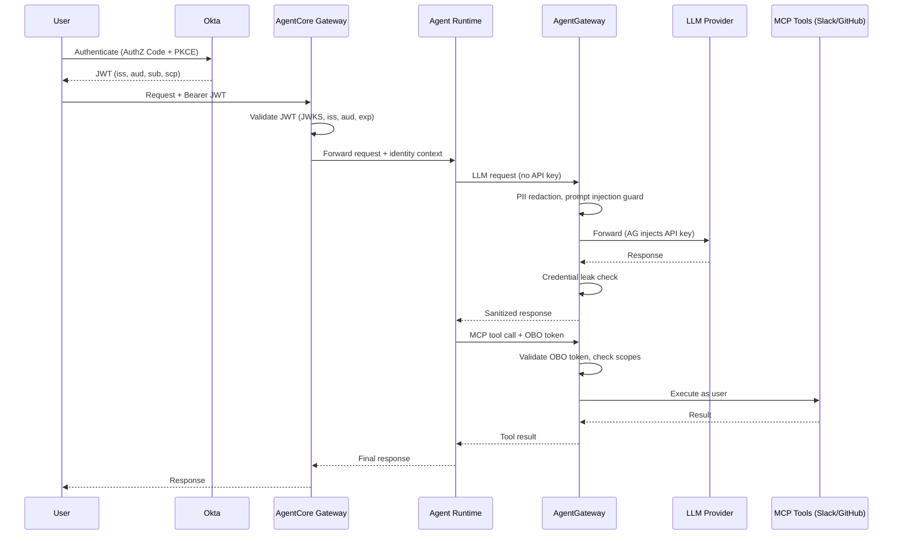

# Authentication & Authorization Flow: End-to-End Token Lifecycle

> **Audience:** Enterprise security teams, compliance officers, and architects evaluating this AI agent architecture for regulated environments (banking, financial services, healthcare).

---

## 1. Overview

Every request in this architecture traverses an authenticated chain — from human identity through agent execution to downstream tool invocation. There are **no ambient credentials**, **no hardcoded API keys in agent code**, and **no unauthenticated hops**.

The flow:

```
User → Okta (AuthZ Code + PKCE) → JWT → AgentCore Gateway (validates JWT)
  → Agent Runtime (receives identity context)
    → AgentGateway (LLM proxy — holds API keys, enforces policies)
    → AgentGateway (MCP proxy — OBO token, scope-based access to tools)
```

**Key invariants:**
- The agent container has **zero secrets** — no LLM API keys, no tool credentials, no Okta client secrets
- Every hop validates identity; a compromised agent cannot escalate privileges
- All operations are traced to the originating human user for audit



---

## 2. Identity Components

### 2.1 Okta Authorization Server

The architecture uses Okta's **default** authorization server with custom scopes for fine-grained MCP tool access.

| Property | Value |
|----------|-------|
| Auth Server ID | `aus104zseyg64swj3698` |
| Issuer | `https://integrator-7147223.okta.com/oauth2/aus104zseyg64swj3698` |
| Discovery URL | `https://integrator-7147223.okta.com/oauth2/aus104zseyg64swj3698/.well-known/openid-configuration` |
| JWKS URI | `https://integrator-7147223.okta.com/oauth2/aus104zseyg64swj3698/v1/keys` |

**Terraform — Auth Server reference and custom scopes:**

```hcl
data "okta_auth_server" "default" {
  name = "default"
}

resource "okta_auth_server_scope" "mcp_read" {
  auth_server_id   = data.okta_auth_server.default.id
  name             = "mcp:read"
  description      = "Read access to MCP tools via AgentGateway"
  consent          = "IMPLICIT"
  metadata_publish = "ALL_CLIENTS"
}

resource "okta_auth_server_scope" "mcp_write" {
  auth_server_id   = data.okta_auth_server.default.id
  name             = "mcp:write"
  description      = "Write access to MCP tools via AgentGateway"
  consent          = "IMPLICIT"
  metadata_publish = "ALL_CLIENTS"
}

resource "okta_auth_server_scope" "mcp_admin" {
  auth_server_id   = data.okta_auth_server.default.id
  name             = "mcp:admin"
  description      = "Admin access to MCP tools (e.g. Slack post, GitHub write)"
  consent          = "REQUIRED"           # Explicit user consent required
  metadata_publish = "ALL_CLIENTS"
}
```

The `REQUIRED` consent on `mcp:admin` ensures users explicitly approve admin-level operations — they cannot be silently granted.

### 2.2 OAuth2 Applications

Two separate apps enforce **separation of human identity from machine identity**:

**App 1 — User-Facing Client** (Authorization Code + PKCE):

```hcl
resource "okta_app_oauth" "agentcore_client" {
  label                      = "devops-copilot-client"
  type                       = "web"
  grant_types                = ["authorization_code", "refresh_token"]
  redirect_uris              = [var.agent_redirect_uri]
  post_logout_redirect_uris  = [var.agent_post_logout_uri]
  token_endpoint_auth_method = "client_secret_basic"
  response_types             = ["code"]
}
```

- Client ID: `0oa104zvj88F21SEe698`
- Used by: the human user authenticating via browser
- Grant: Authorization Code + PKCE (no implicit flow — PKCE mitigates authorization code interception)

**App 2 — Agent Service** (Machine-to-Machine):

```hcl
resource "okta_app_oauth" "agentcore_service" {
  label                      = "devops-copilot-service"
  type                       = "service"
  grant_types                = ["client_credentials"]
  token_endpoint_auth_method = "client_secret_basic"
  response_types             = ["token"]
}
```

- Client ID: `0oa104zvbj26VVleo698`
- Used by: AgentCore for On-Behalf-Of token exchange
- Grant: Client Credentials — the agent service authenticates itself, then exchanges the user's token for a delegated token with MCP scopes

### 2.3 Auth Server Policy

A whitelist policy ensures **only these two apps** can request MCP-scoped tokens:

```hcl
resource "okta_auth_server_policy" "agentcore" {
  auth_server_id   = data.okta_auth_server.default.id
  name             = "AgentCore Policy"
  description      = "Token policy for AgentCore demo apps"
  priority         = 1
  client_whitelist = [
    okta_app_oauth.agentcore_client.client_id,
    okta_app_oauth.agentcore_service.client_id,
  ]
}

resource "okta_auth_server_policy_rule" "agentcore_rule" {
  auth_server_id                  = data.okta_auth_server.default.id
  policy_id                       = okta_auth_server_policy.agentcore.id
  name                            = "Allow MCP scopes"
  priority                        = 1
  grant_type_whitelist            = ["authorization_code", "client_credentials"]
  scope_whitelist                 = ["openid", "profile", "email", "mcp:read", "mcp:write", "mcp:admin"]
  group_whitelist                 = [data.okta_group.everyone.id]
  access_token_lifetime_minutes   = 60
  refresh_token_lifetime_minutes  = 1440
  refresh_token_window_minutes    = 1440
}
```

**Key controls:**
- `access_token_lifetime_minutes = 60` — tokens expire in 1 hour; compromised tokens have limited blast radius
- `group_whitelist = Everyone` — all org users can authenticate (restrict this to specific groups in production)
- `scope_whitelist` — explicitly enumerates allowed scopes; no wildcard

---

## 3. Step-by-Step Token Flow

### Step 1: User Authentication

The user authenticates via the **Authorization Code + PKCE** flow. The browser redirects to:

```
https://integrator-7147223.okta.com/oauth2/aus104zseyg64swj3698/v1/authorize?
  client_id=0oa104zvj88F21SEe698
  &response_type=code
  &scope=openid profile email mcp:read mcp:write
  &redirect_uri=https://agent.example.com/callback
  &state=<random>
  &code_challenge=<S256 hash of code_verifier>
  &code_challenge_method=S256
```

After the user authenticates, Okta redirects back with an authorization code. The app exchanges it for tokens.

For **demonstration purposes**, the simpler client_credentials grant shows the same token structure:

```bash
curl -s -X POST \
  "https://integrator-7147223.okta.com/oauth2/aus104zseyg64swj3698/v1/token" \
  -H "Content-Type: application/x-www-form-urlencoded" \
  -d "grant_type=client_credentials" \
  -d "client_id=0oa104zvbj26VVleo698" \
  -d "client_secret=<REDACTED>" \
  -d "scope=mcp:read mcp:write"
```

**Decoded JWT payload:**

```json
{
  "ver": 1,
  "jti": "AT.3xK8mR2pVq1nL9fYwZbCdE7hJ0kMnOpQrStUvWxYz",
  "iss": "https://integrator-7147223.okta.com/oauth2/aus104zseyg64swj3698",
  "aud": "api://default",
  "iat": 1739541000,
  "exp": 1739544600,
  "cid": "0oa104zvbj26VVleo698",
  "uid": "00u1a2b3c4d5e6f7g8h9",
  "sub": "jane.doe@example.com",
  "scp": ["mcp:read", "mcp:write"]
}
```

**What matters here:**
- `iss` — identifies which Okta auth server issued this token (validated downstream)
- `aud` — `api://default` — the AgentCore Gateway will reject tokens with any other audience
- `sub` — the human user's identity, carried through the entire chain
- `scp` — scopes determine exactly what MCP tools this user can invoke
- `exp` — 1 hour from `iat`; expired tokens are rejected at every validation point

### Step 2: AgentCore Gateway Validates JWT

The AgentCore Gateway was created with a **CUSTOM_JWT authorizer** pointing to Okta's OIDC discovery endpoint:

```bash
aws bedrock-agentcore-control create-gateway \
  --name "devops-copilot-gateway" \
  --role-arn "arn:aws:iam::role/devops-copilot-agentcore-gateway" \
  --protocol-type "MCP" \
  --authorizer-type "CUSTOM_JWT" \
  --authorizer-configuration '{
    "customJWTAuthorizer": {
      "discoveryUrl": "https://integrator-7147223.okta.com/oauth2/aus104zseyg64swj3698/.well-known/openid-configuration",
      "allowedAudience": ["api://default"]
    }
  }'
```

**Actual Terraform** (`gateway.tf`):

```hcl
resource "null_resource" "gateway" {
  # ...
  provisioner "local-exec" {
    command = <<-EOT
      aws bedrock-agentcore-control create-gateway \
        --name "${self.triggers.name}" \
        --role-arn "${self.triggers.role_arn}" \
        --protocol-type "MCP" \
        --authorizer-type "CUSTOM_JWT" \
        --authorizer-configuration "{\"customJWTAuthorizer\":{\"discoveryUrl\":\"${self.triggers.okta_issuer}/.well-known/openid-configuration\",\"allowedAudience\":[\"api://default\"]}}" \
        --no-cli-pager --output json
    EOT
  }
}
```

**The gateway performs these validations on every request:**

| Check | How | Failure |
|-------|-----|---------|
| Signature (RS256) | Fetches JWKS from Okta discovery endpoint, verifies JWT signature | `401 Unauthorized` |
| Issuer (`iss`) | Must match the configured Okta auth server | `401 Unauthorized` |
| Audience (`aud`) | Must include `api://default` | `401 Unauthorized` |
| Expiration (`exp`) | Must be in the future (with clock skew tolerance) | `401 Unauthorized` |

**If any check fails, the request is rejected immediately.** The agent runtime never sees invalid requests.

### Step 3: Agent Runtime Receives Authenticated Request

Once the gateway validates the JWT, it forwards the request to the agent container with the **identity context attached**. The agent knows:

- **Who** is calling (`sub` claim → `jane.doe@example.com`)
- **What** they're authorized to do (`scp` claim → `["mcp:read", "mcp:write"]`)

The agent container itself has **no secrets**:
- No LLM API keys (Anthropic, OpenAI)
- No Okta client secrets
- No MCP tool credentials
- Only the AgentGateway URL for outbound requests

### Step 4: Agent Calls LLM via AgentGateway

When the agent needs to invoke an LLM (Claude, GPT-4, etc.), it sends the request to **AgentGateway's LLM proxy endpoint** — not directly to the LLM provider.

AgentGateway is the **single point of control** for LLM access:

1. **API Key Injection** — AgentGateway holds the LLM API keys (stored as Kubernetes Secrets, managed by ArgoCD). The agent never sees them.
2. **Pre-request Policy Enforcement:**
   - **PII Detection/Redaction** — SSNs, credit card numbers, email addresses are redacted before reaching the LLM provider
   - **Prompt Injection Guard** — known injection patterns are blocked
   - **Credential Leak Protection** — prevents secrets from appearing in LLM responses
3. **Observability** — every request is traced to **Langfuse** with the user's identity (`sub` claim), model used, token count, latency, and cost

The agent sends a standard LLM API request; AgentGateway transparently injects the API key and applies policies.

### Step 5: On-Behalf-Of Token Exchange for MCP Tools

When the agent needs to call MCP tools (Slack, GitHub, Jira), it needs a **delegated identity token** — the agent acts *as the user*, not as itself.

The **OAuth2 Credential Provider** configured in AgentCore handles this exchange:

```bash
aws bedrock-agentcore-control create-oauth2-credential-provider \
  --name "devops-copilot-okta-obo" \
  --credential-provider-vendor "CustomOIDC" \
  --oauth2-provider-config-properties '{
    "issuer": "https://integrator-7147223.okta.com/oauth2/aus104zseyg64swj3698",
    "clientId": "<service-app-client-id>",
    "clientSecret": "<REDACTED>",
    "authorizationEndpoint": ".../v1/authorize",
    "tokenEndpoint": ".../v1/token",
    "scopes": ["openid", "mcp:read", "mcp:write"]
  }'
```

**Terraform** (`credentials.tf`):

```hcl
resource "null_resource" "okta_credential_provider" {
  provisioner "local-exec" {
    command = <<-EOT
      aws bedrock-agentcore-control create-oauth2-credential-provider \
        --name "${self.triggers.name}" \
        --credential-provider-vendor "CustomOIDC" \
        --oauth2-provider-config-properties '{
          "issuer": "${self.triggers.issuer}",
          "clientId": "${self.triggers.client_id}",
          "clientSecret": "${self.triggers.client_secret}",
          "authorizationEndpoint": "${self.triggers.issuer}/v1/authorize",
          "tokenEndpoint": "${self.triggers.issuer}/v1/token",
          "scopes": ["openid", "mcp:read", "mcp:write"]
        }'
    EOT
  }
}
```

**The exchange flow:**

1. Agent presents the user's validated identity context to the credential provider
2. The **service app** (`devops-copilot-service`) authenticates to Okta using client credentials
3. Okta issues a **new token** that carries:
   - The original user's identity (`sub`)
   - The requested MCP scopes (`mcp:read`, `mcp:write`)
   - The service app as the acting client (`cid`)
4. This OBO token is used for MCP tool calls

**Result:** When the agent posts a Slack message, it appears **as the user**. When it creates a GitHub issue, it's **attributed to the user**. The agent never has standing access to these tools.

### Step 6: AgentGateway MCP Policy Enforcement

AgentGateway validates the OBO token on every MCP route and enforces **scope-based access control**:

| Scope | Allowed Operations | Denied Operations |
|-------|--------------------|-------------------|
| `mcp:read` | List Slack channels, get GitHub issues, read Jira boards | Post messages, create issues, modify boards |
| `mcp:write` | All of `mcp:read` + post messages, create issues, comment | Delete channels, admin operations |
| `mcp:admin` | All of `mcp:write` + delete, configure, admin operations | — |

**Additional enforcement:**
- **Rate limiting** — applied per-user (the identified human, not the agent), preventing abuse even if an agent is compromised
- **Full tracing** — every tool call is logged with user identity, tool name, arguments, and result
- **Dual export** — traces go to Langfuse (LLM analytics) and ClickHouse (gateway metrics)

---

## 4. Security Properties

### Zero Trust Principles

| Principle | How It's Enforced |
|-----------|-------------------|
| **Every hop authenticated** | User→Okta→JWT→Gateway validates→Agent receives identity→AgentGateway validates OBO→Tools |
| **No ambient authority** | Agent container has zero secrets; cannot call LLMs or tools without going through AgentGateway |
| **Least privilege** | Scopes (`mcp:read`, `mcp:write`, `mcp:admin`) control exactly what tools the user can invoke |
| **Token expiration** | 60-minute access tokens; validated at every hop; refresh tokens capped at 24 hours |
| **Defense in depth** | Even if one layer is bypassed, the next layer independently validates identity and scopes |

### Audit Trail

Every operation produces a traceable record:

```
User Request (trace-id: abc-123)
  ├── Gateway: JWT validated for jane.doe@example.com [2024-02-14T15:30:00Z]
  ├── Agent: Received request, scopes=[mcp:read, mcp:write]
  ├── LLM Call: claude-sonnet-4-20250514, 1,247 input tokens, 384 output tokens, $0.0034
  │   ├── PII redacted: 2 email addresses, 1 phone number
  │   └── Prompt injection: none detected
  ├── MCP Tool: slack.list_channels (mcp:read) → 200 OK, 23 channels
  ├── MCP Tool: slack.post_message (mcp:write) → 200 OK, channel=#ops-alerts
  └── Response returned to user [latency: 3.2s]
```

**Export destinations:**
- **Langfuse** — LLM-specific analytics: model usage, token costs, prompt/completion pairs, user attribution
- **ClickHouse** — gateway metrics: request rates, latencies, policy violations, error rates

### Secrets Management

| Secret | Location | Accessible By |
|--------|----------|---------------|
| LLM API keys (Anthropic, OpenAI) | Kubernetes Secrets (ArgoCD-managed) | AgentGateway only |
| Okta client secrets | Terraform state (encrypted) + AWS Secrets Manager | AgentCore credential provider only |
| Agent container credentials | **None** | N/A — agent has zero secrets |

**Credential rotation** does not require agent redeployment. Update the AgentGateway config or Okta credential provider; agents are unaffected because they never hold credentials directly.

### Policy Enforcement

| Policy | Enforcement Point | Mechanism |
|--------|-------------------|-----------|
| PII redaction | AgentGateway (pre-LLM) | Regex + NER detection; redacted before request leaves the gateway |
| Prompt injection | AgentGateway (pre-LLM) | Pattern matching + classifier; request blocked with 403 |
| Credential leak | AgentGateway (post-LLM) | Response scanning; secrets masked before reaching agent |
| Rate limiting | AgentGateway | Per-user (from JWT `sub`), not per-agent |
| Scope enforcement | AgentGateway (MCP routes) | OBO token `scp` claim checked against tool requirements |

All policies are defined in **declarative YAML** and managed via **GitOps** (ArgoCD). Changes are version-controlled, reviewed, and auditable.

---

## 5. Comparison: With vs Without Gateway

| Concern | Without Gateway | With AgentGateway |
|---------|----------------|-------------------|
| **API Keys** | Embedded in agent code or env vars | Centralized in gateway; agent has zero secrets |
| **Authentication** | Each agent implements its own auth | Okta JWT + OBO enforced at gateway; agents receive validated identity |
| **PII Protection** | Sent directly to LLM providers | Redacted at gateway before reaching any LLM provider |
| **Audit Trail** | Manual logging per agent (inconsistent) | Automatic tracing on every LLM and tool call with user identity |
| **Rate Limits** | Per-agent, easily bypassed | Per-user, centrally enforced |
| **Key Rotation** | Redeploy every agent | Update gateway config; zero agent changes |
| **Policy Changes** | Code changes in each agent | Declarative YAML, GitOps-managed, instant propagation |
| **Blast Radius** | Compromised agent has full API key access | Compromised agent has no credentials; limited to its validated scope |
| **Compliance Evidence** | Varies per team | Single gateway provides consistent audit logs for all agents |

---

## 6. How to Verify

These commands demonstrate the full token lifecycle end-to-end.

### 6.1 Obtain a Token from Okta

```bash
# Client credentials grant (for demo/testing)
TOKEN_RESPONSE=$(curl -s -X POST \
  "https://integrator-7147223.okta.com/oauth2/aus104zseyg64swj3698/v1/token" \
  -H "Content-Type: application/x-www-form-urlencoded" \
  -d "grant_type=client_credentials" \
  -d "client_id=${OKTA_SERVICE_CLIENT_ID}" \
  -d "client_secret=${OKTA_SERVICE_CLIENT_SECRET}" \
  -d "scope=mcp:read mcp:write")

ACCESS_TOKEN=$(echo "$TOKEN_RESPONSE" | jq -r '.access_token')
echo "$TOKEN_RESPONSE" | jq .
```

### 6.2 Decode and Inspect the JWT

```bash
# Decode the payload (middle segment)
echo "$ACCESS_TOKEN" | cut -d'.' -f2 | base64 -d 2>/dev/null | jq .
```

Expected output:
```json
{
  "iss": "https://integrator-7147223.okta.com/oauth2/aus104zseyg64swj3698",
  "aud": "api://default",
  "sub": "0oa104zvbj26VVleo698",
  "scp": ["mcp:read", "mcp:write"],
  "exp": 1739544600,
  "iat": 1739541000
}
```

Verify: `iss` matches your Okta issuer, `aud` is `api://default`, `scp` contains requested scopes.

### 6.3 Invoke AgentCore with the Token

```bash
# Call the AgentCore Gateway endpoint
GATEWAY_ENDPOINT="https://<gateway-id>.agentcore.<region>.amazonaws.com"

curl -s -X POST "${GATEWAY_ENDPOINT}/invoke" \
  -H "Authorization: Bearer ${ACCESS_TOKEN}" \
  -H "Content-Type: application/json" \
  -d '{"prompt": "List the open GitHub issues in the ops repository"}'
```

- **200 OK** — token is valid, agent processes the request
- **401 Unauthorized** — token validation failed (check iss, aud, exp)

### 6.4 Verify with an Expired/Invalid Token

```bash
# Use a garbage token — should get 401
curl -s -X POST "${GATEWAY_ENDPOINT}/invoke" \
  -H "Authorization: Bearer invalid.token.here" \
  -H "Content-Type: application/json" \
  -d '{"prompt": "test"}'

# Expected: {"message": "Unauthorized"}
```

### 6.5 Check Langfuse Traces

Open the Langfuse dashboard and filter by user identity:

```
Langfuse → Traces → Filter by user: jane.doe@example.com
```

Each trace shows:
- User identity (from JWT `sub`)
- Model used and token counts
- PII redactions applied
- Tool calls with arguments and results
- Total latency and cost

### 6.6 Check AgentGateway Logs

```bash
# Kubernetes logs showing policy enforcement
kubectl logs -n agentgateway deployment/agentgateway --tail=50 | \
  grep -E "(policy|redact|blocked|scope)"
```

Look for:
- `pii_redacted: 2 entities` — PII was caught and redacted
- `scope_check: mcp:write ALLOWED` — scope validation passed
- `prompt_injection: BLOCKED` — injection attempt was stopped
- `rate_limit: user=jane.doe@example.com remaining=47/50` — per-user rate limiting

---

## Summary

This architecture enforces **authenticated identity at every boundary**:

1. **Okta** establishes human identity with standards-based OAuth2/OIDC
2. **AgentCore Gateway** validates JWTs before any request reaches agent code
3. **Agent Runtime** operates with zero standing credentials
4. **AgentGateway** centralizes LLM API keys, enforces security policies, and provides complete audit trails
5. **OBO Token Exchange** ensures MCP tool calls carry delegated user identity with fine-grained scopes

For compliance teams: every LLM call and every tool invocation is traced to a specific human user, with policy enforcement at the gateway layer, exportable to your SIEM via Langfuse and ClickHouse.

**No secrets in agent code. No unauthenticated hops. Full audit trail. Every token validated.**
