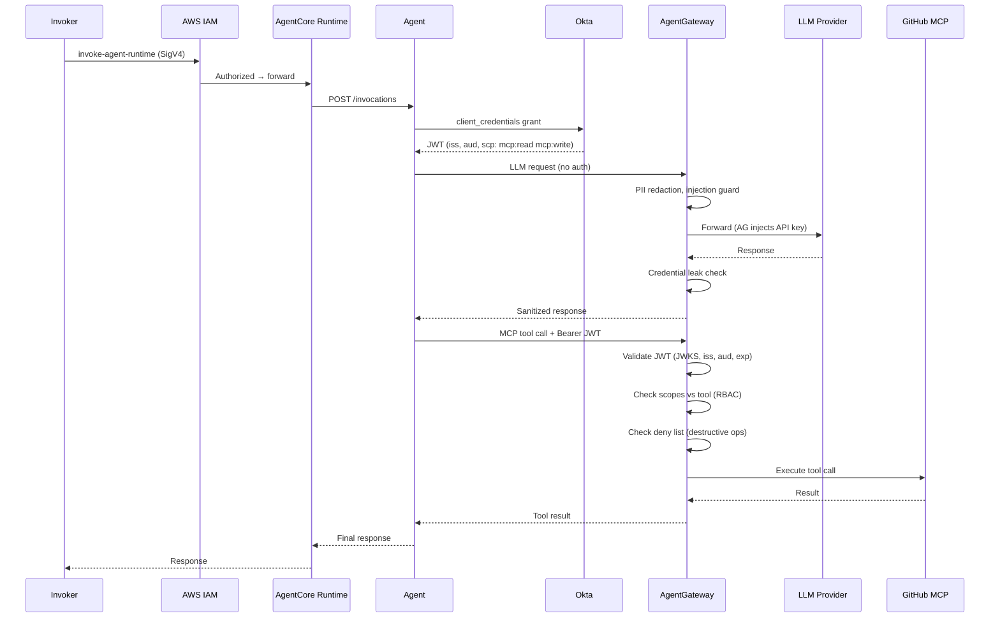

# Authentication & Authorization Flow: End-to-End

> **Audience:** Enterprise security teams, compliance officers, and architects evaluating this AI agent architecture.

---

## 1. Overview

Every MCP request in this architecture traverses an authenticated chain. There are **no ambient credentials** and **no hardcoded API keys in agent code**.

```
Invoker → AWS IAM (SigV4) → AgentCore Runtime → Agent
  Agent → Okta (client_credentials) → JWT with MCP scopes
  Agent → AgentGateway LLM (no auth — AG holds API keys)
  Agent → AgentGateway MCP (Bearer JWT) → validated → scope RBAC → tools
```

**Key invariants:**
- The agent container holds **only Okta client credentials** — no LLM API keys, no tool credentials
- AgentGateway validates JWTs and enforces scope-based RBAC on every MCP call
- All operations are traced with `jwt.sub` for audit



---

## 2. Identity Components

### 2.1 Okta Authorization Server

| Property | Value |
|----------|-------|
| Auth Server | `default` (ID: `aus104zseyg64swj3698`) |
| Canonical Issuer | `https://integrator-7147223.okta.com/oauth2/default` |
| JWKS URI | `https://integrator-7147223.okta.com/oauth2/default/v1/keys` |

**Important:** The canonical issuer in JWT tokens is `oauth2/default`, NOT `oauth2/aus104zseyg64swj3698`. Both paths work for API calls, but the `iss` claim uses `default`.

### 2.2 OAuth2 Application

The agent uses a single **service app** with client_credentials:

```hcl
resource "okta_app_oauth" "agentcore_service" {
  label                      = "devops-copilot-service"
  type                       = "service"
  grant_types                = ["client_credentials"]
  token_endpoint_auth_method = "client_secret_basic"
  response_types             = ["token"]
}
```

### 2.3 Custom MCP Scopes

```hcl
resource "okta_auth_server_scope" "mcp_read" {
  name    = "mcp:read"
  consent = "IMPLICIT"    # Auto-granted
}

resource "okta_auth_server_scope" "mcp_write" {
  name    = "mcp:write"
  consent = "IMPLICIT"    # Auto-granted
}

resource "okta_auth_server_scope" "mcp_admin" {
  name    = "mcp:admin"
  consent = "REQUIRED"    # Explicit consent required
}
```

---

## 3. Step-by-Step Token Flow

### Step 1: Agent Gets Okta Token

The agent uses `client_credentials` — no user interaction:

```python
async def get_okta_token() -> str:
    if _token_cache["access_token"] and time.time() < _token_cache["expires_at"] - 300:
        return _token_cache["access_token"]

    resp = await http_client.post(
        OKTA_TOKEN_URL,
        data={"grant_type": "client_credentials", "scope": "mcp:read mcp:write"},
        auth=(OKTA_CLIENT_ID, OKTA_CLIENT_SECRET),
    )
    data = resp.json()
    _token_cache["access_token"] = data["access_token"]
    _token_cache["expires_at"] = time.time() + data.get("expires_in", 3600)
    return data["access_token"]
```

**Decoded JWT:**
```json
{
  "iss": "https://integrator-7147223.okta.com/oauth2/default",
  "aud": "api://default",
  "sub": "0oa104zvbj26VVleo698",
  "scp": ["mcp:read", "mcp:write"],
  "exp": 1739544600
}
```

Token is cached with a 5-minute buffer before expiry.

### Step 2: LLM Calls (No Auth)

The agent calls AgentGateway's LLM proxy without any authentication:

```python
url = f"{LLM_GATEWAY_URL}/anthropic/v1/chat/completions"
resp = await http_client.post(url, json=payload, headers=headers)
```

AgentGateway holds provider API keys as Kubernetes Secrets and injects them. Before forwarding, it applies:
- **PII redaction** — SSNs, credit cards, emails stripped
- **Prompt injection guard** — jailbreak patterns blocked
- **Credential leak check** — secrets in responses masked

### Step 3: MCP Calls (JWT Auth)

Every MCP call includes the Okta JWT:

```python
headers["Authorization"] = f"Bearer {token}"
headers["Mcp-Session-Id"] = session_id  # Required after initialize
```

### Step 4: AgentGateway Validates JWT

The `EnterpriseAgentgatewayPolicy` on k8s-rooster validates every MCP request:

```yaml
apiVersion: enterpriseagentgateway.solo.io/v1alpha1
kind: EnterpriseAgentgatewayPolicy
metadata:
  name: mcp-jwt-auth-ent
spec:
  targetRefs:
  - group: gateway.networking.k8s.io
    kind: HTTPRoute
    name: mcp-github
  traffic:
    jwtAuthentication:
      mode: Strict
      providers:
      - issuer: "https://integrator-7147223.okta.com/oauth2/default"
        audiences: ["api://default"]
        jwks:
          inline: '<Okta JWKS JSON>'
```

**Validation checks:** JWT signature (RS256), issuer, audience, expiration. Failed = `401 Unauthorized`.

### Step 5: Scope-Based RBAC

Once authenticated, tool access is controlled by CEL expressions:

```yaml
# mcp:read → read-only tools
claims.scp.exists(s, s == 'mcp:read') && (
  tool.name.startsWith('list_') || tool.name.startsWith('get_')
)

# mcp:write → read + write tools
claims.scp.exists(s, s == 'mcp:write') && (
  tool.name.startsWith('create_') || tool.name.startsWith('post_')
)
```

| Scope | Allowed | Denied |
|-------|---------|--------|
| `mcp:read` | List issues, get repos, search code | Create issues, update files |
| `mcp:write` | All of read + create issues, update files | Delete repos, merge PRs |
| `mcp:admin` | Full access | Destructive ops (always blocked) |

**How it works at the MCP level:**
- `tools/list` responses are **filtered** — unauthorized tools hidden
- `tools/call` requests are **rejected** if scopes don't match

### Step 6: Destructive Operation Blocking

Always denied regardless of scope:

```yaml
tool.name.contains('delete') || tool.name.contains('merge_pull_request')
```

---

## 4. Security Properties

| Principle | How It's Enforced |
|-----------|-------------------|
| **Two-layer auth** | AWS IAM gates invocation; Okta JWT + AgentGateway gates tool access |
| **No ambient authority** | Agent holds Okta creds only; LLM keys in K8s Secrets |
| **Least privilege** | Scopes control exactly which tools are accessible |
| **Token expiration** | 60-minute tokens; cached with 5-min buffer |
| **Full audit trail** | Every MCP call logged with `jwt.sub` identity |

### Secrets Management

| Secret | Location | Accessible By |
|--------|----------|---------------|
| LLM API keys | K8s Secrets (ArgoCD) | AgentGateway only |
| GitHub PAT | K8s Secret (`github-mcp-secret`) | AgentGateway MCP backend only |
| Okta client ID/secret | AgentCore env vars | Agent container only |

---

## 5. How to Verify

### Get a Token
```bash
curl -s -X POST \
  "https://integrator-7147223.okta.com/oauth2/default/v1/token" \
  -d "grant_type=client_credentials&scope=mcp:read mcp:write" \
  -u "${OKTA_CLIENT_ID}:${OKTA_CLIENT_SECRET}" | jq .
```

### Invoke the Agent
```bash
PAYLOAD=$(echo -n '{"input":"Create an issue on ProfessorSeb/ai-kagent-demo"}' | base64 -w0)
aws bedrock-agentcore invoke-agent-runtime \
  --agent-runtime-arn "$RUNTIME_ARN" \
  --content-type "application/json" \
  --payload "$PAYLOAD" response.json
```

### Check MCP Gateway Logs
```bash
kubectl logs -n agentgateway-system deploy/mcp-gateway-proxy --tail=20
# Look for: jwt.sub=0oa104zvbj26VVleo698 → authenticated
```

### Verify Unauthenticated Rejection
```bash
curl -s -X POST http://172.16.10.168:30168/mcp-github \
  -H "Content-Type: application/json" \
  -d '{"jsonrpc":"2.0","id":1,"method":"initialize","params":{...}}'
# Expected: 401 "no bearer token found"
```
